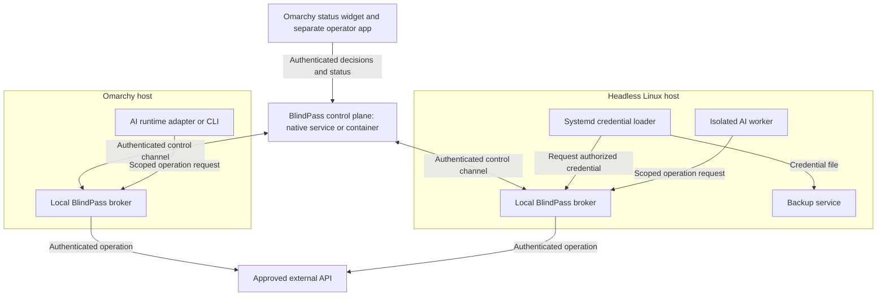

# BlindPass for Linux: Omarchy and Fleet Access

**Date:** 2026-09-12  
**Status:** Research and proposed implementation; the user requested this direction in the product review and native/container control-plane deployment support. No deployment parity is implemented or verified by this document.  
**Scope assumption:** One operator-controlled server manages workload identity, credential access, approvals, and audit across Linux hosts. Existing tools continue to schedule jobs and manage process lifecycles.  
**Related:** [Product review](Product%20Review%202026-09.md), [roadmap reset](Roadmap%20Reset%202026-09.md), [pilot test plan](../testing/Native%20Linux%20Fleet%20Pilot.md).  
> **Partly superseded (2026-09-12).** [Round two](Linux%20Fleet%20Research%20Round%202%202026-09.md) tested the systemd credential socket on this host and corrected several claims below, including the SPIRE selector names, the rotation mechanism, and the assurance level of same-UID operation. See its [corrections table](Linux%20Fleet%20Research%20Round%202%202026-09.md#6-corrections-to-round-one) before acting on this document.

## Recommendation

Explore an OS-native access layer, with Omarchy as the first operator experience and Linux as the underlying platform. Treat an AI runtime, a backup service, and a deployment worker as workloads with different permissions. The useful product promise is: **approve what a workload can do, on which machine, for how long, without pasting credentials into agent conversations.**

The control plane must be deployable either as a native Linux service or as a container. Both packages serve the same fleet APIs and policy model. Omarchy is an operator interface and possible controller host, not a required server distribution.

This direction addresses the missing step between receiving a secret and using it. It can reuse parts of BlindPass's control plane, but adds a substantial new security boundary: a trusted host broker. Validate that boundary and one useful workflow before building a general fleet platform.

The opportunity is a small-fleet operator experience that joins human approval, fresh credential provisioning, and actual credential use. OS secret delivery and workload identity already have capable implementations. Broad Linux support alone is not a defensible claim of uniqueness.

## Research basis and limits

Read-only local inspection found Omarchy 4.0.3, the Omarchy package reporting 4.0.3-1, and systemd 261.2-1-arch. These versions establish a possible development baseline; they do not establish compatibility with other hosts. No system configuration was changed and no broker, SPIRE deployment, or multi-host flow was exercised. The credential socket was subsequently exercised in [round two](Linux%20Fleet%20Research%20Round%202%202026-09.md#1-verified-systemd-credential-socket-authentication), using transient units in user scope only.

Repository inspection covered the current JWT/JWKS middleware, identity helpers, exchange policy and approval services, workspace policy storage, and plugin secret storage. Primary documentation was checked on 2026-09-12. Observed capabilities are cited below; architecture, scope, and pilot targets are recommendations.

## Existing building blocks

| Component | What is documented today | Role in the proposal |
|---|---|---|
| systemd credentials | Service activation can acquire credentials from a file or Unix socket; applications receive a credential directory. Credentials remain fixed for that activation. Optional encryption can bind stored material to the local installation and TPM. | First integration for ordinary Linux services; explicitly handle restart and rotation semantics. [Systemd credentials](https://systemd.io/CREDENTIALS/) |
| SPIRE | A server and per-node agents attest nodes and workloads. Unix and systemd attestors can use kernel-derived process attributes and unit properties. | Evaluate as the identity backend before implementing equivalent attestation and certificate machinery. [SPIRE concepts](https://spiffe.io/docs/latest/spire-about/spire-concepts/), [systemd attestor](https://github.com/spiffe/spire/blob/main/doc/plugin_agent_workloadattestor_systemd.md) |
| Omarchy shell | The desktop has discoverable plugins, but they share an unsandboxed shell process. | A status and notification entry point; keep secret values and custody keys out of the plugin. [Omarchy shell documentation](https://github.com/omacom/omarchy/blob/quattro/docs/omarchy-shell.md) |
| Polkit | Privileged mechanisms can authorize requests from unprivileged subjects and invoke a session authentication agent when needed. | Local authorization for narrowly defined administrative actions; fleet approval still needs its own identity and request binding. [Polkit manual](https://polkit.pages.freedesktop.org/polkit/polkit.8.html) |
| Vault Agent | Supports authentication, secret/token renewal, templates, caching, and child-process environment injection. | Existing alternative and potential later secret source; generic Linux secret delivery is already served. [Vault Agent](https://developer.hashicorp.com/vault/docs/agent-and-proxy/agent) |
| Infisical Agent | Authenticates, fetches secrets, renders files, and supports template update hooks. | Another existing alternative; compare setup and ongoing operation against it. [Infisical Agent](https://infisical.com/docs/integrations/platforms/infisical-agent) |

Omarchy is a useful starting environment because the operator already uses it and its plugin surface supports a native entry point. Market demand among Omarchy users remains untested. The server and node broker should work on headless Linux without Hyprland or Quickshell.

## Architecture



The diagram shows control and consumption paths. Credential provisioning is a separate flow: the operator's input client encrypts to a verified destination broker key, and SPS may relay ciphertext. A broker that performs authenticated operations becomes a plaintext endpoint. The product must identify that endpoint accurately instead of describing every mode as decryption only inside the AI agent.

### Central control plane

Run one instance as either a native Linux service or a container, independent of the desktop session. It owns node enrollment, workload registrations, policy versions, approval records, access grants, revocation state, and metadata audit records. The pilot should exercise both packages against the same two-host topology. The controller may run on Omarchy or a separate always-on Linux host without changing node APIs.

A laptop that sleeps cannot make new authorization decisions for its fleet. Treat offline behavior as a product decision rather than hiding it behind retries. The initial policy should deny new grants while disconnected and give any permitted existing grant an explicit expiry. Already delivered credentials have separate lifecycle limitations described below.

Keep workload requests off chat transports. Nodes should establish authenticated connections to the controller and receive decisions through that channel, with bounded reconnect behavior and no requirement for publicly exposed worker ports.

### Native and container deployment contract

These are packaging choices for one controller, with equal product capabilities:

| Concern | Native service | Container |
|---|---|---|
| Package and lifecycle | Versioned Linux release, dedicated service account, systemd startup/shutdown and restart policy | Versioned OCI image, non-root application process, documented Docker Compose startup/shutdown and restart policy |
| Configuration | Documented configuration and protected service credential inputs | Same configuration schema, supplied through mounted configuration and protected runtime inputs |
| Durable state | Explicit state locations and database connections outside the release directory | Declared volumes and database connections outside the disposable container filesystem |
| Signing and trust material | Protected independently of the executable release | Injected at runtime; never baked into image layers or regenerated on each container start |
| Network | Authenticated API with documented TLS/reverse-proxy configuration | Same API and TLS expectations, only documented service ports exposed |
| Operations | Health/readiness, logs, graceful shutdown, migrations, backup/restore | Equivalent health/readiness and lifecycle semantics |

Native installation must work with natively managed or external database services and no container runtime. The Compose profile may include backing services or connect to externally managed ones. Keep application behavior independent of that choice. Native and container packaging must use the same supported schema/version compatibility policy.

The controller container must not require privileged mode, the host PID namespace, a host service-manager socket, or a container-engine socket. It does not attest host workloads directly. Initial host brokers remain native services even when their controller is containerized; containerized brokers or workload-specific container integrations require separate design and tests.

Document native-to-container and container-to-native migration using supported state export or database backup/restore. Preserve the controller's identity and trust material, policy, audit history, and durable authorization state; invalidate expired or revoked grants rather than resurrecting them. Preserve a stable endpoint where possible. If address or trust changes are necessary, provide an explicit transition procedure instead of silently reenrolling every node.

The migration procedure must fence or stop the previous controller before activating its replacement. This is a single-controller pilot, not a high-availability claim. Protect and test signing-key recovery as well as database recovery; a volume holding only application data is not a complete backup.

### Per-host broker

The broker identifies local callers, verifies grants, obtains or decrypts credentials, and either performs a permitted operation or supplies an approved service. Its local API should use Unix sockets with OS-derived peer identity. Its node identity authenticates the connection to the controller, but must not automatically authorize every workload on that node.

Use privilege separation. Retain the existing TypeScript controller; do not run the full SPS application as a root daemon on every machine. Establish the minimal privileged host functions first, then choose the implementation language and packaging based on required OS APIs. No new runtime or dependency is selected by this proposal.

### Omarchy operator experience

The shell widget shows pending request counts, disconnected nodes, and access status, and opens a dedicated approval application. Display a controller-verified workload identity, host, resource, action, duration, and whether the workload receives plaintext. Treat agent-provided purpose text as an untrusted description, not authorization evidence.

Secret entry and custody keys should stay outside the shared shell plugin process. A separate application reduces that shared-process exposure; it does not make a compromised desktop account trustworthy. For stronger isolation, untrusted workers must not share the operator's account, writable approval code, desktop IPC sockets, or administrative privileges.

## Two explicit consumption modes

| Mode | Consumer behavior | Honest guarantee | Initial use |
|---|---|---|---|
| Brokered operation | Requests a named operation; the broker authenticates to the target and returns a constrained result. | The credential is retained by the trusted broker and is not deliberately supplied to the AI process. Output handling and target behavior remain part of the boundary. | One authenticated API operation from an AI runtime. |
| Service credential delivery | Receives a credential file or descriptor and uses it directly. | Delivery is controlled; the approved consumer can read and potentially disclose the plaintext. | A systemd-managed backup service. |

A CLI wrapper that puts a token in the AI process's environment belongs to credential delivery. It cannot claim the model is unable to access the token if that runtime can inspect its own environment or execute arbitrary code. The same limitation applies to a credential file exposed to that runtime.

The first brokered adapter should implement one fixed operation against one configured API origin. Validate the method, resource identifiers, and response schema; reject user-selected destination URLs, cross-origin redirects, credential-bearing debug output, and arbitrary shell execution. An opaque handle must remain bound to its workload and grant. A generic HTTP proxy or arbitrary `run-with-secret` tool would considerably enlarge the attack surface.

For a meaningful real-world example, let a worker request a deployment status read from a designated project using a token entered by the operator. Start with read-only access; extend to deployment mutations only when their exact authorization and retry semantics are implemented.

## Native Linux service integration

Systemd's `LoadCredential=` can connect to a Unix socket before service execution. A broker can therefore supply a credential without requiring an AI integration in the service. A unit drop-in would map one credential name to a broker endpoint, and the application would consume it through its normal credential-file option. Applications that only accept an environment value require a separately documented compatibility path. [Systemd credential interfaces](https://systemd.io/CREDENTIALS/)

There is an important authentication detail: the caller in this path is the service-manager credential loader, not an already running workload. Systemd includes the requested unit and credential identifier in the connecting abstract socket name. Those strings are routing metadata, not independent proof of authorization. Authenticate the service-manager context and enforce an administrator-controlled unit-to-credential mapping; reject fabricated names from ordinary clients. Verify this against the installed systemd implementation. [Systemd execution manual source](https://github.com/systemd/systemd/blob/main/man/systemd.exec.xml)

Start with system-managed units under distinct service users. A user-controlled unit name, executable path, or a shared desktop UID is insufficient to distinguish adversarial workloads. Unit definitions, broker adapters, and privilege-bearing launch profiles must be protected from workload modification.

Rotation must specify what actually happens. Changing a broker's value does not refresh a credential already loaded by systemd. The service needs an explicit restart, or a different application-supported refresh integration. Do not silently restart unrelated services as a side effect of approving access.

For the pilot, pre-provision the backup credential to its host before starting the service. Do not leave boot indefinitely waiting for an interactive human approval. Missing credentials must cause a bounded, visible failure.

## Identity and policy model

Use three separately recorded identities:

1. **Operator:** the human or administrative service permitted to approve or change policy.
2. **Node:** an enrolled host with its own protected key and lifecycle.
3. **Workload:** an administrator-registered service or broker-launched worker tied to that node and a verified OS execution context.

A workload should never gain identity merely by sending `agent_id: deployer`. Unix peer credentials provide OS identity information, but additional protected registration and execution boundaries are required to map that information to a workload. Do not trust arbitrary PID fields from requests. Account for process exit, PID reuse, interpreter executables shared by multiple scripts, and broker connections shared by multiple sessions. [Linux Unix socket documentation](https://www.man7.org/linux/man-pages/man7/unix.7.html)

SPIRE merits a bounded feasibility check: it already has Unix UID/GID selectors and systemd unit selectors. Verify behavior for the intended system services and launch model rather than assuming user-session services have identical support. A SPIFFE-shaped string in an existing BlindPass JWT does not establish attestation or interoperability. [Unix attestor](https://github.com/spiffe/spire/blob/main/doc/plugin_agent_workloadattestor_unix.md), [systemd attestor](https://github.com/spiffe/spire/blob/main/doc/plugin_agent_workloadattestor_systemd.md)

Recommended authorization tuple:

```text
workspace + node + workload + resource + action
+ consumption mode + audience + expiry + policy version
+ approval reference + recipient-key binding
```

The controller can distribute decisions, while each broker enforces a locally configured maximum authority. A remote grant cannot exceed that local ceiling. Recheck policy at execution, scope request IDs and handles to the authenticated caller, and make one-use grants atomic. A compromised controller remains a serious authorization risk even when its database contains no plaintext credentials.

A single host running multiple agents is already a fleet for policy purposes. The stronger profile must isolate worker accounts or containers from the operator and each other. Same-user desktop operation can remain a convenience mode with clearly narrower assurances. The host administrator and kernel are trusted in both modes.

## Custody, unattended use, and revocation

For the initial flow, encrypt directly to a destination broker key bound to the enrolled node. The operator verifies the intended node and workload before submitting. Distinguish encrypted relay storage from a malicious-controller threat: if the controller can substitute recipient keys without detection, ciphertext storage alone does not protect the handoff.

For unattended services, purely ephemeral memory cannot survive restart. Choose either a named external credential provider or a node-local encrypted store with explicit recovery and unlock policy. For the pilot, evaluate local systemd encrypted credentials; TPM support must be detected and fallback behavior made visible. No plaintext escrow is proposed for SPS.

Do not assume the controller can re-encrypt an existing ciphertext for a new node. That requires the operator or an authorized plaintext-holding issuer to perform a new encryption. Every destination needs its own authorization. Future A2A fulfillment could supply this, but is not required to prove the pilot.

Expose three different operations in the product:

| Operation | What it can accomplish |
|---|---|
| Revoke access grant | Stops subsequent broker-authorized actions or credential deliveries after the revocation is observed, or the grant expires. |
| Stop a managed consumer | Ends that process's access; cannot recall data the process already copied or sent elsewhere. |
| Revoke or rotate at the provider | Invalidates the underlying credential when the provider supports it and the operation succeeds. |

A grant's short TTL does not change a third-party API key's lifetime. During a network partition, a node cannot instantly learn central revocation. Existing service credential files are not erased simply because a control-plane record expires. The UI and tests must reflect these distinctions.

## Reuse from this repository

| Existing area | Reuse candidate | New work still required |
|---|---|---|
| [SPS auth](../../packages/sps-server/src/middleware/auth.ts) | Issuer/audience/JWKS validation and workspace binding | Node enrollment, key lifecycle, OS attestation, and mapping external identities into workspaces. |
| [Workspace policy](../../packages/sps-server/src/services/workspace-policy.ts) and [exchange policy](../../packages/sps-server/src/services/policy.ts) | Versioned configuration, validation, deny/allow/approval patterns | Authorize operations and delivery modes, not only requester-to-fulfiller exchanges. |
| [Approvals](../../packages/sps-server/src/services/approval.ts) and [audit](../../packages/sps-server/src/services/audit.ts) | Request-linked decisions and metadata recording | Bind node, workload, exact operation, policy version, and expiry; local enforcement and reconnect reconciliation. |
| [Agent crypto](../../packages/agent-skill/src/key-manager.ts) | HPKE utilities | Recipient identity/key binding and host custody lifecycle review. |
| Browser UI and dashboard | Secret entry and operator views | Destination identity display, node status, and delivery-mode-aware approval. |
| OpenClaw integration | Existing adapter experience | A runtime-independent broker interface; no dependence on chat delivery for fleet control. |

Do not rewrite the existing exchange protocol into an operation-grant protocol without separate types and tests. Their semantics differ: consuming an encrypted payload once is not the same as permitting an API operation for a period of time.

## Proposed pilot and stopping gate

The pilot is deliberately small: one controller, two enrolled hosts, Omarchy as the operator interface, one AI client completing one brokered authenticated operation, and one non-AI systemd service consuming a credential. Run the topology once with a native controller and once with a container controller, including a separate controller host. A second AI client later demonstrates that the broker contract is independent of its adapter.

| Checkpoint | Evidence required before expansion |
|---|---|
| Identity and consumption spike | Distinct local workloads cannot impersonate each other; service-loader identity is verified; SPIRE fit is assessed without selecting dependencies prematurely. |
| Single-host workflow | Operator supplies a credential, approves a specific workload action, and observes successful completion with a clean transcript and metadata audit. A backup service also succeeds through native credential delivery. |
| Two-host workflow | The same control plane handles a headless worker, rejects cross-node grant reuse, and shows honest offline/revocation behavior. |
| Deployment parity | Native and container controllers pass the same workflows; container replacement preserves state; tested migration in both directions preserves enrolled nodes and trust without concurrent controllers. |
| Operator validation | At least three external operators attempt setup, and at least two repeat real workflows without maintainer intervention. These are experiment targets, not evidence of existing demand. |

Define and implement the [E2E and integration scenarios](../testing/Native%20Linux%20Fleet%20Pilot.md) with feature work, following [repository instructions](../../AGENTS.md). The test plan is currently entirely proposed.

Continue only if users value the combined approval and consumption workflow, and the isolation model is practical. If operators mostly want templated secrets on Linux, prefer an integration with an established manager over rebuilding one. If isolation requires permissions users will not accept, narrow the supported workload profile rather than overclaiming OS-wide protection.

## Scope boundaries and decisions

Omarchy packaging and a shell widget are the first desktop experience. Native-service and container controller packages are both initial distribution requirements. A minimal headless broker is the portability boundary. Initial fleet management covers inventory, identity, policy, grants, approvals, health, and audit. Systemd or existing schedulers retain process and job management.

A later native action adapter could authorize a narrowly specified operation such as restarting one registered service. It would use a privileged helper with fixed actions and target validation, not accept arbitrary shell commands from the controller. General job scheduling, remote terminal access, package deployment, eBPF enforcement, Kubernetes management, and a full replacement vault remain outside the pilot.

The user can choose to expand the control plane into orchestration, but that is a separate product scope decision. Other open decisions are which real API operation and backup service to validate, whether the controller needs continuous availability, the custody/recovery mode for unattended secrets, and whether SPIRE's operational cost is acceptable for the intended fleet size.
