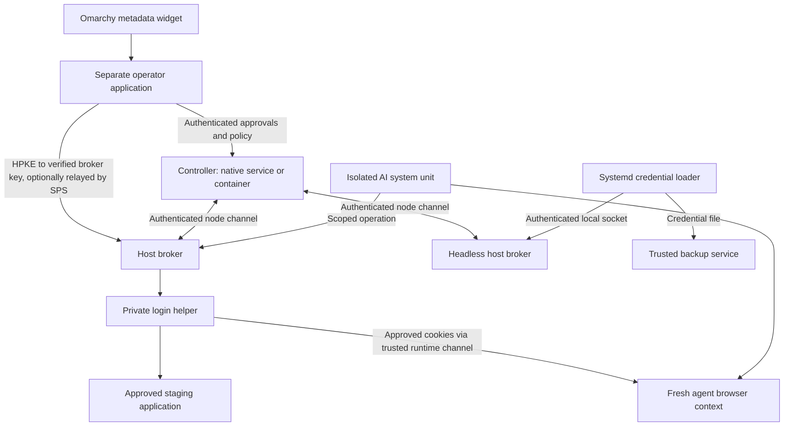

# BlindPass Product Specification

**Consolidated:** 2026-09-22

**Status:** Proposed Linux fleet and browser-pilot contract, not an implementation or support declaration.

**Companions:** [Roadmap](Roadmap.md) · [E2E and integration test plan](../testing/Linux%20Fleet%20Pilot.md)

The implementation phases in the Obsidian vault translate this contract into P00–P10 work packages and paired acceptance plans. They do not change the trust boundaries or establish implementation. Package locations are accepted in Decisions 0001/0002; new API contracts still require their named phase review; W0–W6 and existing test IDs remain stable.

## Scope and status

The pilot joins human approval, encrypted provisioning, and completed credential use across a small Linux fleet. One controller governs two enrolled hosts. Omarchy is the first operator interface; headless workers and a separate controller host must work. Both native-service and container controller packaging are required. Host brokers remain native services.

The proposed AI operation is login to one approved staging application followed by session handoff for an authenticated UI task. It accompanies an ordinary systemd backup service that writes and restores a disposable artifact. Choosing the application, browser runtime, accounts, and backup integration remains an implementation prerequisite. No general browser platform, CI federation, account pool, scheduler, remote shell, or replacement vault is included.

Existing SPS/exchange and OpenClaw functionality is a reusable foundation. The September research did not implement a host broker, node attestation, browser session adapter, or deployment parity. The September 22 consolidation confirms that the MCP entry point still uses `Content-Length` framing and protocol `2024-11-05`, and the local `SecretStore` has no built-in expiry. The subsequent documentation alignment checked auth storage, token hashing/expiry, the HPKE suite and frontend configuration; see the [current threat model](../security/blindpass-threat-model.md). Other dated findings below require fresh verification before being described as current defects or fixes.

## Components and trust boundaries



| Component | Responsibility and boundary |
|---|---|
| Controller | Enrollment, protected workload registrations, policy versions, approvals, grants, revocation, node health, metadata audit. No source-secret plaintext custody in the relay path |
| Native host broker | OS-derived caller identity, grant/local-ceiling enforcement, recipient keys and credential custody, bounded operations or service delivery. This is a trusted plaintext endpoint |
| Operator application | Authenticate the approver, show verified request identity and scope, accept secret input, verify the destination key, and encrypt to the broker |
| Omarchy widget | Pending counts, node/status metadata, and opening the operator application. No credential values, keys, or authority to approve |
| AI adapter/runtime | Request a permitted operation and receive defined results; browser mode intentionally grants the agent session authority |
| Private login helper | Trusted login recipe/API and browser process isolated from the agent, with private capture disabled |
| Native service | Explicitly trusted plaintext consumer; validates credentials at startup and manages its own credential-use lifecycle |

Host root, the kernel, protected service definitions, broker code, operator application, and the approved application's deployed login code are trusted. Agent-controlled code must not be able to modify the login endpoint receiving a shared password. The controller's lack of plaintext does not neutralize its authorization power or recipient-key substitution risk.

The shell widget shares an unsandboxed host process with other plugins. A separate approval application reduces shared-process exposure but does not make a compromised desktop account trustworthy. Worker accounts must not access operator desktop IPC, writable approval code, broker keys, private login profiles/debug endpoints, or administrative privileges. [Omarchy shell research source](https://github.com/omacom/omarchy/blob/quattro/docs/omarchy-shell.md)

## Identity and authorization

Record separate operator, node, and workload identities. A node has a protected key and explicit enrollment, rotation, revocation, and recovery lifecycle. A workload is administrator-registered on that node and bound to a protected system unit, dedicated service account, and verified invocation. Self-reported `agent_id`, PID, executable name, purpose text, or unit name is never authority.

For running workload requests, authenticate Unix socket peers using OS-derived account and pidfd-based system-unit/invocation identity; then enforce registration, exact operation, current policy, approval, and local authority ceiling. Keep this operation interface distinct from the root-only service credential-loader socket. The running AI process and its Chromium process are non-root. A unit restart requires new invocation-bound authority.

The proposed grant contract includes:

```text
workspace + node + workload + unit invocation + resource/account + action
+ consumption mode + audience + expiry + policy version
+ approval reference + recipient-key binding + request/use identity
```

Define operation grants separately from existing encrypted-payload exchange records. Atomic one-time ciphertext retrieval does not implement an operation authorization lifecycle.

Requirements:

- Bind requests, handles, sessions, and results to the authenticated workload and invocation. Reject cross-node/workspace/account/session reuse, wrong audiences/modes, expired or modified grants, and stale invocation authority.
- Recheck the applicable policy and local ceiling at execution, including policy/revocation changes after approval. A controller-signed decision cannot exceed locally configured maximum authority.
- Consume one-use grants atomically. Define operation-specific idempotency and uncertain-result recovery; a lost response must not permit an unsafe duplicate operation or orphan session.
- Support scoped, time-bounded grants and grouped approvals without silently broadening authority. Show verified node/workload, resource, action, duration, consumption mode, and plaintext recipient separately from untrusted purpose text.
- Authenticate administrative operations with controller roles and applicable local authorization, such as a narrow Polkit helper. Possessing the UI or supplying an operator ID is insufficient.
- Use authenticated node-initiated control channels, bounded retries/queues, and explicit reconciliation; do not require public inbound worker ports or use chat as the fleet control channel.

New grants fail closed when the controller is unavailable. Existing grants cannot authorize broker work past their expiry; disconnected revocation is bounded by connectivity and expiry, not instantaneous. Prevent clock rollback from extending authority. Reconnect must not resurrect revoked grants or old policy decisions.

### Service credential-loader authentication

P01 has two socket profiles. Both authenticate the connecting process with root `SO_PEERCRED`, `SO_PEERPIDFD`, and a single pidfd-bound systemd lookup that returns the unit and invocation together. The direct helper sends a framed unit and credential claim. Stock `LoadCredential=` sends no frame; systemd places `unit/<unit>/<credential>` in the abstract client address as a routing hint.

For the direct helper profile, accept on a root-owned filesystem Unix socket with mode `0600`, require root `SO_PEERCRED`, obtain `SO_PEERPIDFD`, and resolve unit ID plus invocation ID in one pidfd-bound systemd `GetUnitByPIDFD` reply. Require the helper's claimed unit to match that identity, then enforce the root-controlled unit-to-credential mapping. Missing pidfd or systemd lookup support is an explicit unsupported-host result. Do not use raw PIDs or `/proc` parsing.

For native `LoadCredential=`, the pidfd-derived identity must be root and its unit must exactly match the route's unit; the resolved invocation must be present. The broker then checks the exact unit/credential pair against its root-controlled mapping. The route is never authorization by itself. The disposable Ubuntu 24.04/systemd 255 run confirmed that the credential-setup caller resolves to the consuming service unit and invocation, not `init.scope`; hosts with different behavior fail closed. Denials close the stream without writing error text because systemd would treat any written bytes as credential contents. Empty and malformed values must still be rejected by the consumer.

The native and direct-helper routes both fail closed for user-manager peers. Direct helper requests are bounded by one deadline covering identity resolution and frame reading. The native path is exercised with real `LoadCredential=` units; protect its socket and mapping files as privileged configuration.

Do not authorize using raw PID fields, `/proc` parsing, the `sd_peer_get_*` family, a random socket-name prefix, or the claimed unit alone. Use protected system-unit registration and dedicated accounts; user-manager credential delivery and shared-desktop-UID isolation are excluded from the supported pilot profile.

The September 12 probe on Omarchy 4.0.3, systemd 261.2, and kernel 7.2.3 tested **user scope only**. A normal process fabricated `\0deadbeefdeadbeef/unit/postgresql.service/db-password`; a naive server delivered the dummy credential. Genuine and forged peers shared UID 1000, while cgroup context differed. The random prefix was per connection and was not an authentication signal. `SO_PEERPIDFD` availability was observed locally. These findings demonstrate the routing-name flaw; they are not evidence of a working secure broker or system-scope implementation.

Systemd versions other than the pinned systemd 255 profile, `DynamicUser=`, cross-account socket access, encrypted credential socket semantics, forced numeric PID reuse, and timeout behavior remain disposable-VM gates. Pidfd handling must be verified end to end; adopting an API name alone is not proof of race-free authorization. [Systemd credential implementation](https://raw.githubusercontent.com/systemd/systemd/main/src/core/exec-credential.c), [pid/unit API and race warning](https://raw.githubusercontent.com/systemd/systemd/main/man/sd_pid_get_owner_uid.xml), [Unix sockets](https://man7.org/linux/man-pages/man7/unix.7.html)

### Identity backend decision

Use direct pidfd-based host identity as the proposed pilot baseline. Keep identity representation compatible with a future SPIFFE integration, without claiming attestation or interoperability from a SPIFFE-shaped JWT string.

The September round-two review reported SPIRE systemd selectors `systemd:id` and `systemd:fragment_path`, a PID-based attestor, and a declined pidfd migration proposal. This supersedes the earlier recommendation to adopt SPIRE first for local attestation. Re-evaluate actual versions and race behavior if selecting SPIRE later; do not substitute it without equivalent identity evidence. [SPIRE systemd attestor](https://github.com/spiffe/spire/blob/main/doc/plugin_agent_workloadattestor_systemd.md), [pidfd proposal](https://github.com/spiffe/spire/issues/6035)

## Consumption modes

| Mode | Plaintext/authority recipient | Guarantee and limit |
|---|---|---|
| Fixed brokered API operation | Trusted broker retains source credential; agent receives a constrained result | Validate configured origin, method, action, resource and response schema. No arbitrary HTTP proxy, shell command, user-selected destination, or credential-bearing response |
| Browser session handoff, mode 1 | Trusted broker/login helper holds password; agent receives an application session | Protect against accidental source-password disclosure. Agent can extract/use its session through unrestricted tools; the application must bound and revoke that authority |
| Native service delivery | Approved service receives credential file or descriptor | Authenticate delivery; the service can read, copy, or disclose plaintext. This does not provide consumer containment or model blindness |

Environment injection or a credential file readable by an AI runtime is delivery mode. Calling it an opaque reference does not stop a runtime with shell access from reading its contents. The text [egress filter](../../packages/gateway/src/egress-filter.ts) is URL replacement, not browser network enforcement.

For a fixed API adapter, enforce the configured destination and operation, reject alternate hosts/redirects/header injection/path traversal, and validate responses and errors before serialization. A deployment-status read remains an alternative bounded operation if the browser proposal is not selected; it is not an additional W1 platform requirement.

## Browser session handoff

### Application prerequisites

Use one HTTPS staging origin and one dedicated low-privilege account, with a second static account only for isolation checks. Serialize account use where needed; no automatic account leasing is required.

The application must enforce a maximum server-side session lifetime that continuing activity cannot extend indefinitely, plus tested server-side revocation. Browser cookie expiry alone is insufficient. Exclude applications requiring transferable durable refresh tokens or unsupported device-bound state.

The account must be unable to change password/recovery details, enroll authenticators, mint API tokens, or authorize durable integrations through either UI or direct endpoints. A hidden menu or navigation filter does not satisfy this requirement. Prefer a read-only role. If the application cannot enforce these limits, reject it for the pilot. Neither BlindPass nor browser isolation hides a password from the receiving website.

### Operation lifecycle

1. The registered workload requests the configured account/operation. The host broker authenticates its OS execution context and checks the grant, deadline, local ceiling, and approved receiving browser integration.
2. The operator provisions the source credential through existing HPKE mechanisms to a verified broker recipient key. Do not decrypt first inside the AI runtime. SPS may relay ciphertext; the operator must be able to detect unauthorized key/destination substitution.
3. A trusted helper authenticates through the application's supported API where possible, or a fixed tested login recipe in a private browser process/account inaccessible to the agent. Never log in inside an agent-owned page with prior scripts, listeners, or network hooks.
4. Confirm successful authentication and import only approved session cookies into a fresh context bound to the requesting workload/invocation. Validate cookie domain, path, security attributes, application scope, and receiving context. Transfer cookie values through a trusted runtime channel.
5. Destroy the private login context. Return a context reference and a defined safe status, such as `authenticated`, `invalid_credentials`, or `unsupported_authentication`. Never return passwords, cookie values, full profiles, history, unrelated storage, raw application errors, or uploaded/cached auth-state files.
6. The agent uses ordinary browser tools to complete the authenticated UI task. Separate accounts require separate contexts; tabs do not isolate cookies.
7. On completion, cancellation, expiry, or recovery after broker/agent restart, stop further broker use, revoke the website session within the declared bound, and destroy the agent context. Test copied-cookie replay. Report revocation failure and block account reuse until resolved.

Treat crash-before-handoff, lost replies, partial cookie import, and uncertain server-side session creation as lifecycle states requiring reconciliation or revocation. Record enough protected session/revocation state to support the declared recovery behavior, without leaking bearer material into ordinary audit records. If recovery cannot revoke immediately, the application's maximum lifetime remains an independent upper bound and the account stays unavailable.

### Exposure and compatibility

Disable traces, screenshots/video, HAR, raw console forwarding, and credential-bearing error capture **before** private login begins. Export only defined statuses and metadata. Check normal post-handoff artifacts for accidental password/session disclosure; deliberately extracting the agent's own session is an expected mode-1 boundary, not evidence of strong confinement.

Reject unsafe plaintext-exposure configuration, including `BLINDPASS_ALLOW_EXPOSE_PLAINTEXT`, for this operation. Source custody expiry, grant expiry, SPS handoff TTL, and website session lifetime are separate controls. Buffer disposal is best-effort; do not claim complete erasure from JavaScript/browser memory or persistent-storage protection based solely on disabling core dumps.

Unsupported MFA, passkeys, CAPTCHA, device binding, redirects, or token-storage requirements return a bounded unsupported status or use an already approved human path. There is no automatic fallback to filling an agent-controlled page. [Playwright authentication](https://playwright.dev/docs/auth), [trace capture](https://playwright.dev/docs/trace-viewer)

### Deferred browser modes

Strong mode would prevent deliberate credential/session extraction and requires a constrained replacement for unrestricted browser tools plus isolation from alternate CDP, browser, shell, profile, storage, and network paths. W1 does not claim this. The source research notes that Playwright MCP's secret replacement and origin filters are not security boundaries. [Playwright MCP](https://github.com/microsoft/playwright-mcp)

Testing the login UI by filling a form deliberately exposes the password to the tested page. It needs separate selector/input-event, frame/origin, document-race, hidden-field, and navigation tests. A fixed recipe inside the trusted helper needs its own tests but does not activate a generic form-filling product.

A future Chrome extension adds permissions, native-host authorization, MV3 restart/replay, and lifecycle concerns. Content-script isolation does not hide form values from the page. Headless support is a compatibility question, not a blanket exclusion: the research records Playwright's bundled Chromium persistent-context extension path. [Chrome content scripts](https://developer.chrome.com/docs/extensions/develop/concepts/content-scripts), [Playwright extensions](https://playwright.dev/docs/chrome-extensions)

CI fixtures with full browser access treat test code as trusted. Existing environment secrets or vault/OIDC integrations are comparison baselines. Stock GitHub OIDC tokens do not directly meet the SPS middleware's `role: "gateway"` contract. CI federation, pools, retries across shards, and runner lifecycle are deferred with Phase 5. Retained browser/CI scenario IDs remain in the [test plan](../testing/Linux%20Fleet%20Pilot.md#deferred-browser-scenarios).

## Native service delivery and custody

Use native `LoadCredential=name:/path/to/broker.sock` with a protected broker socket and administrator-owned unit-to-credential mapping. The service consumes the staged credential file through its supported file option; environment-only applications need a separately documented adapter. Provision broker custody before activation so boot does not wait indefinitely for an interactive approval.

Each consuming service must validate presence, non-empty content, completeness, and expected syntax before reporting successful startup. The September research records that a socket returning no data can leave an empty credential file; do not assume systemd alone turns every broker error into failed activation. Test denial, crash, stall, partial delivery, size limits, binary values, and one connection per credential. [Empty credential behavior](https://github.com/systemd/systemd/issues/27373), [per-credential connections](https://github.com/systemd/systemd/issues/34223)

Changing stored source material does not refresh an already running consumer. Use a controlled restart as the portable baseline. The round-two research identifies `RefreshOnReload=credentials` on the inspected systemd 261 baseline and reports introduction in v260; use a reload only for a supported, opted-in unit whose application actually reloads the refreshed credential. Prove changed bytes and successful use, not just successful `systemctl reload`. Never restart unrelated services implicitly. [Systemd service manual](https://www.freedesktop.org/software/systemd/man/latest/systemd.service.html)

Custody profiles are explicit:

| Profile | Restart and recovery contract |
|---|---|
| Ephemeral broker memory | Secret becomes unavailable after loss/restart; re-provisioning required |
| Node-local encrypted custody | Protected encrypted store with a selected unlock, key backup, recovery, and rotation policy; evaluate native encrypted credentials |
| External provider, later/if selected | Named supported provider with independently tested authentication, availability, and recovery semantics |

Detect TPM capabilities explicitly. The research reports that `systemd-creds --with-key=auto` can silently choose host-key-only protection. Use the supported capability probe (`systemd-analyze has-tpm2` on the inspected baseline), request the intended key mode, and fail if required TPM protection is unavailable. A separately approved host-key-only profile must be visible; it is not a silent downgrade. Test available/absent TPM, missing recovery material, and encrypted socket semantics. [Systemd credentials](https://systemd.io/CREDENTIALS/)

SPS is not a plaintext escrow. Sending existing ciphertext to a different node does not make it decryptable there; a human or authorized plaintext-holding issuer must encrypt anew to that destination's verified key under separate authorization.

## Revocation and audit

| Action | Actual effect |
|---|---|
| Revoke broker grant | Stops subsequent authorized operations/delivery after observation or expiry; cannot recall delivered material |
| Stop consumer or close browser | Ends that process/context's use; does not revoke copies elsewhere |
| Revoke website session | Invalidates handed-off/copyable session authority only when the application confirms revocation; replay must fail |
| Rotate/revoke provider credential | Invalidates underlying static credential only when the provider supports it and the action succeeds |

Short handoff or grant TTLs do not shorten a third-party API key's lifetime. UI status must distinguish grant revocation, session revocation failure, offline nodes, and outstanding provider-credential risk.

Audit metadata links operator, workspace, node, workload/invocation, action, resource/account reference, consumption mode, approval, grant/request, policy version, result, and relevant expiry. Do not include source values, bearer cookies, secure URLs, confirmation codes, or raw upstream errors. Define bounded buffering or denial when the audit sink is unavailable; test disk-full, duplication, delayed events, and reconnection ordering.

## MCP and human input transport

Use standard newline-delimited JSON-RPC over stdio and keep stdout limited to valid MCP messages. Implement and test each supported protocol version; changing the advertised version string is insufficient. URL-mode elicitation is a **client** capability. An empty elicitation object does not establish URL-mode support, and it must not be advertised alongside server `tools` as a substitute.

The September protocol research specifies version-appropriate `elicitation/create`; for the referenced `2026-07-28` contract it calls for `InputRequiredResult`, request capability metadata, `requestState`, and Multi Round-Trip Requests instead of the removed completion notification. Validate the selected specification/client combination when implementing. Sensitive input goes through URL mode, never a form-mode password field. Bind the link to its initiating operator and verify client consent/display/no-prefetch behavior. [MCP stdio](https://modelcontextprotocol.io/specification/2025-11-25/basic/transports), [referenced elicitation specification](https://modelcontextprotocol.io/specification/2026-07-28/client/elicitation)

Delivery order:

| Order | Transport | Condition |
|---|---|---|
| 1 | MCP URL-mode elicitation | Client advertises the implemented URL-mode capability |
| 2 | Existing OpenClaw chat API | Configured and available |
| 3 | Existing OpenClaw runtime channel/CLI | Configured and available |
| 4 | Existing Telegram fallback | Configured and available |
| 5 | Local browser open | Human and worker share the intended host and `BLINDPASS_LOCAL_OPEN=true` |
| 6 | Authenticated operator application | Remote/headless worker or other supported fallback |

Do not send secure links via MCP stderr by default; clients may retain or forward it. A QR/terminal view needs an explicitly trusted operator surface and a reachable link. Existing `raw_link` and `OPENCLAW_SECRETS_RAW_LINK` remain explicit opt-ins, outside default secrecy claims.

Verify actual client transcripts and logs: a human-visible channel is not automatically outside model context. Test Claude Code plus VS Code or Codex CLI, actual capability negotiation, elicitation unavailability, decline/expiry/cancellation, and safe fallback. Successful secret storage alone does not complete the broker operation.

## Controller deployment and recovery

One controller owns durable fleet state independent of the desktop session. Native and container packages have equal functionality, configuration, identity, policy, API, and data-migration contracts.

| Concern | D-NATIVE | D-CONTAINER |
|---|---|---|
| Lifecycle | Versioned release, dedicated service account, systemd start/stop/restart | Versioned OCI image, non-root application process, Docker Compose lifecycle |
| Backing services | Documented native or external database services; no container dependency | Declared Compose backing services or tested external services |
| Durable state | Explicit protected state/key locations outside release files | Declared persistent volumes/database connections outside disposable image filesystem |
| Configuration and trust | Protected service inputs and signing/key material | Same schema; protected runtime/mounted inputs, no baked-in keys |
| Operations | TLS/authenticated API, health/readiness, sanitized logs, shutdown, migrations, backup/restore | Equivalent semantics and tested outcomes |

The controller container requires no privileged mode, host PID namespace, host systemd socket, or container-engine socket. It does not attest host workloads directly. Docker Compose is the first container target; other OCI runtimes and arbitrary database combinations require their own evidence.

Preserve controller identity, enrolled nodes, trust material, policy, audit, and durable authorization state across restart, image replacement, upgrades, and recovery. Missing volumes/databases/keys or bad configuration must fail readiness without creating an empty fleet or regenerating signing keys silently.

Backups include protected signing/trust material as well as data. Restore and migrate in both directions with a stable endpoint where possible; explicit endpoint/trust transitions replace silent reenrollment if continuity is impossible. Expired, consumed, or revoked grants remain unusable. Recovery must reconcile authorization after a stale snapshot rather than revive authority absent from the snapshot.

Stop or fence the previous instance before the replacement serves the fleet; concurrent independent issuers/writers are unsupported. Define graceful termination and uncertain-operation behavior consistently for both packages. A separate controller host survives Omarchy logout; a controller on a suspended laptop is unavailable in either packaging mode. An embedded ephemeral coordinator is at most a later convenience experiment, not a durable fleet mode.

## Repository foundations

| Existing code | Reuse | Missing pilot work |
|---|---|---|
| [SPS authentication](../../packages/sps-server/src/middleware/auth.ts) | Issuer/audience/JWKS checks and workspace binding | Enrollment, node keys, OS workload identity, operator mapping |
| [Workspace policy](../../packages/sps-server/src/services/workspace-policy.ts), [exchange policy](../../packages/sps-server/src/services/policy.ts) | Versioned configuration and allow/deny/approval patterns | Operation/delivery-mode policy and local ceilings |
| [Approval](../../packages/sps-server/src/services/approval.ts), [audit](../../packages/sps-server/src/services/audit.ts) | Request-linked decisions and metadata persistence | Invocation/operation binding, expiry/revocation reconciliation |
| [Key manager](../../packages/agent-skill/src/key-manager.ts), [runtime](../../packages/agent-skill/src/index.ts) | HPKE helpers | Verified broker recipient binding, host custody lifecycle |
| [Secret store](../../packages/agent-skill/src/secret-store.ts) | Buffer ownership/disposal helpers | `get()` makes plaintext copies; no store-level TTL/use count; enforce lifecycle in broker |
| [Plugin core](../../packages/openclaw-plugin/blindpass-core.mjs), [MCP entry](../../packages/openclaw-plugin/mcp-server.mjs) | Provisioning, default metadata results, adapters | Standard transport and real broker consumption; reject unsafe exposure mode |
| [Encrypted store](../../packages/openclaw-plugin/encrypted-store.mjs), [resolver](../../packages/openclaw-plugin/blindpass-resolver.mjs) | Optional custody and runtime resolution | Plaintext output only in trusted consumer path; retain activation/reload constraints |
| Browser UI and dashboard | Secret entry and operator views | Verified node/workload/destination display, consumption-mode-aware approvals |

The retained crypto baseline is HPKE with X25519, HKDF-SHA256, and ChaCha20-Poly1305, plus atomic payload retrieval. Existing security audits and Redis/PostgreSQL/UI/release tests are useful evidence for their tested paths, not proof of OS isolation or the new browser/deployment contract.

## Repository findings

These preserve the original F identifiers from the September 10 review of commit `5b233c3`, with September 12 additions. The initial consolidation retained historical status; the subsequent September 22 source checks are identified explicitly below. Historical live hosts, registry status, line counts, and activity are not current claims. Resolve each against code or release evidence before closing it.

| ID | Recorded finding and evidence | Roadmap disposition |
|---|---|---|
| F-1 | Plain MCP registers tools/hooks but has no usable non-chat secure-link delivery; `onSecretLink` exhausts OpenClaw/runtime/CLI/Telegram and throws | W1 transport and actual stock-client completion |
| F-2 | MCP pins `2024-11-05`, without URL-mode elicitation | W1 version/capability implementation |
| F-3 | September 10 default `sps.blindpass.dev`/`blindpass.dev` probes failed; `sps.atas.tech` health/readiness and app/secret/landing origins responded | W3 select endpoints, align plugin manifest/core/docs, fresh release probes |
| F-4 | September 10 npm queries for `@blindpass/openclaw-plugin`, `@blindpass/agent-skill`, `@blindpass/sdk`, and `blindpass` returned 404; packages private; dist repository absent; ClawHub unverified | W3 intentional packaging/publication and clean install |
| F-5 | Payments/guest/billing counted 3,915 source lines versus 2,284 core-flow lines, approximately 1.7:1; 6 of 17 migrations related to paid/guest state | Freeze expansion, retain code/tests |
| F-6 | Review recorded 126 commits by one author, ending April 18, after a six-week build and roughly five-month gap | Bound scope and measure effort; historical activity only |
| F-7 | Architecture brainstorm says AES-256-GCM; key manager/browser crypto and skill say ChaCha20-Poly1305 | Documentation corrected on September 22: current architecture/security references name ChaCha20-Poly1305; the old brainstorm is archived. No cipher code changed |
| F-8 | Phase 3E claims refresh cookies/in-memory access tokens; Audit v2 H-2 and threat-model TM-003 describe JS-readable storage | Reconciled on September 22 in the current threat model: hosted non-test cookies coexist with body-token/localStorage compatibility. W5 still owns storage cleanup and auth regression evidence |
| F-9 | September 10 dashboard CSP `connect-src` admitted bare HTTP/HTTPS/WS/WSS schemes | W5 explicit production API/challenge origin allowlist |
| F-10 | HSTS absent on all four probed hosted origins | W5 fresh edge checks and HSTS after HTTPS readiness review |
| F-11 | Browser-input CSP included localhost origins and broad `https:`; landing origin lacked baseline headers | W5 separate production CSP and baseline header validation |
| F-12 | September 12 framing probe: newline-delimited initialize returned 0 bytes, `Content-Length` returned 169 bytes; not a stock-client E2E | W1 standard framing, stdout hygiene, real client tests |
| F-13 | Plugin-local secret map does not bridge credentials into a stock client's shell/unrelated tools | W1 authenticated operation and explicit consumer contract |

The product review carried the March audit status forward. Audit v2 is now a historical snapshot in the Obsidian vault; the [current threat model](../security/blindpass-threat-model.md) owns the September 22 interpretation and explicitly identifies source checks:

| Audit IDs | Recorded item | Handling |
|---|---|---|
| H-3 / L-4; M-7 / M-1 | Historical code-entropy concern and gateway `Math.random()` | September 22 source: SPS has 6,400 combinations, gateway 1,600; W5 generation/entropy remediation remains open |
| M-2 / M-3 | March report: plaintext verification tokens without expiry | Superseded by September 22 source check: `user_tokens` stores SHA-256 hashes with expiry and one-use consumption; preserve W5 regression evidence, no new test pass claimed |
| M-5; L-5 | Length-only password validation; no account-level lockout | W5 evaluate active authentication controls alongside IP rate limits |
| L-1 / L-2 | Sensitive generated keys missing from ignore rules; committed logs | W5 package/repository hygiene; preserve evidence without shipping sensitive artifacts |
| L-6 | Dashboard requests lack client-side timeouts | W5 bounded active operator flows |
| M-4 | x402 facilitator response trust | Retained security backlog on frozen payment surface |
| M-8 | Guest subject identity anchored to IP | Retained security backlog on frozen guest surface |

Older phase status snapshots and forward brainstorms describe their original implementation context. They do not override the [current roadmap freeze](Roadmap.md#freeze-register). Documentation conflicts for F-7/F-8 are reconciled with dated source evidence; remaining auth exposure and header issues are not declared fixed, and original deployment probes were not repeated.

## Open decisions and release evidence

| Decision | Must be settled by |
|---|---|
| Select browser session handoff as W1 operation; choose real staging app, UI task, browser integration and restricted accounts | Before application-specific W1 implementation |
| Select backup service/destination, custody mode, unlock and recovery procedure | Before service-flow implementation and unattended-use claims |
| Broker language, privilege split, minimum kernel/systemd matrix and invocation lookup mechanism | Rust direction accepted in [Decision 0002](decisions/0002-rust-controller-and-broker.md); P01 in the Obsidian vault must prove the remaining privilege/matrix/invocation details on real system-scope VMs before P03 start and P02.6 cutover; the P02 port runs independently after P00 |
| Supported controller database topologies, stable endpoint/trust transition and stale-backup reconciliation | P02 in the Obsidian vault implements SQLite/PostgreSQL adapters without Redis; P06 reviews/tests deployment profiles and migration scope. Cross-database conversion is separate from native/container migration |
| Exact supported MCP/client versions and safe fallback path | W1 client gate, before release claims |
| Numeric operation/startup timeouts, grant TTLs, reconnect/backoff, revocation bounds, audit buffering and approval-frequency ceiling | Measured and recorded before W3 recruitment; no unspecified bound counts as a pass |
| Component licensing and self-hosted/hosted pricing | Separate commercial decision after evidence; current licenses remain in force |

The [test plan](../testing/Linux%20Fleet%20Pilot.md) is the single acceptance catalog. It retains fleet E/I/C/O/D identifiers and prefixes browser cases with `B-`, incorporates round-two authentication/rotation/TPM corrections, and adds client/release and later-milestone coverage. Each implemented scenario needs an implementation location, environment/version, execution date, outcome, and sanitized evidence. All proposed scenarios remain unexecuted until that evidence exists.

The [consolidation record](Roadmap.md#consolidation-record) identifies source dates and provenance. External links retained here are research references, not a fresh verification of changing upstream behavior.
